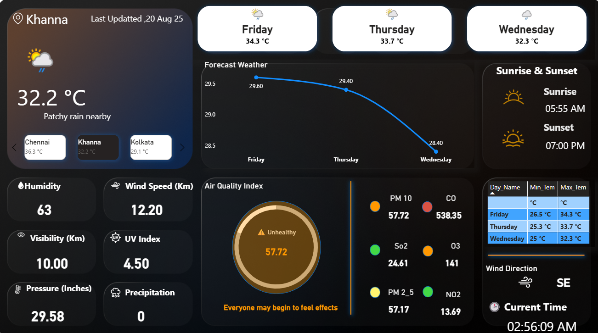
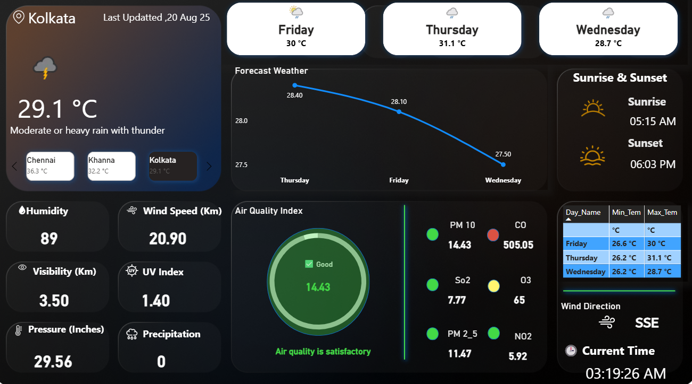

# 🌦️ Live Weather Dashboard – Power BI

An **interactive, real-time weather dashboard** built in **Power BI**, powered by a live **Weather API**.
This project transforms raw JSON API data into **visually engaging, decision-friendly insights** and also provides a **2-day temperature forecast**.

---

## ✨ Key Features

🔹 **Current Weather Conditions**

* 🌡️ Temperature (°C)
* 💧 Humidity (%)
* 🌪️ Pressure (hPa)

🔹 **Wind & Air Quality**

* 🌬️ Wind Speed & Direction
* 🫁 Air Quality Index (AQI)

🔹 **Time & Sun Cycle**

* 🕒 Current Local Time (dynamic)
* 🌅 Sunrise & Sunset
* ☀️ Sunshine Duration (custom DAX measure)

🔹 **Forecasting**

* 📈 2-Day Temperature Forecast
* Visual trend charts for proactive planning

---

## 🛠️ Tech Stack

* **Power BI** → Interactive dashboard design
* **Weather API** → Real-time + forecast data source
* **Power Query** → Data extraction & transformation
* **DAX (Data Analysis Expressions)** → Custom calculations for time & KPIs
* **JSON** → API response parsing

---

## ⚙️ How It Works

1️⃣ **Data Fetching** → Connect to Weather API using Power BI Web connector

2️⃣ **Transformation** → Clean & structure JSON with Power Query

3️⃣ **DAX Measures** → Build custom fields like:

* `Current Local Time` = NOW() adjusted to timezone
* Pressure conversions if needed

4️⃣ **Visualization Layer** → KPIs, cards, charts, and forecast visuals

---

## 📊 Dashboard Preview

---

## 📌 Learnings & Takeaways

* 🔗 How to integrate **live APIs in Power BI**
* 🧮 Writing **DAX measures** for custom time-based metrics
* 🎨 Dashboard design for **clarity + storytelling**
* 📈 Extending beyond real-time into **forecasting**

---

## 🚀 Future Scope

* 7-day extended forecast
* Weather alerts (rain, storms, AQI warnings)
* Deploy public version on **Power BI Service**

---

## 🔗 Links

* 📂 **Repository** → \[https://github.com/Shubham1919284/Live_Weather_Dashboard/blob/main/README.md]
* 💼 **LinkedIn Showcase Post** → \[https://www.linkedin.com/in/shubham-kumar-jha-1a2b3c/]

---

⭐ If you found this useful, consider giving this repo a star to support!

